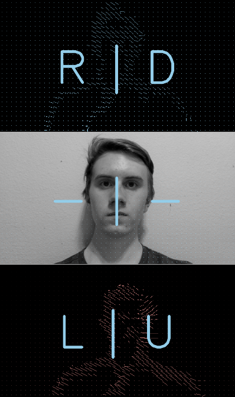

# [Kinesis](https://github.com/Mousai-Neurotechnologies/Kinesis)
Automatic Motion Tracking for Movement Decoding

**Kinesis** records user movement and automatically assigns labels to co-recorded electroencephalograpy (EEG) data. This allows for rapid development of machine learning (ML) models that decode movement intent from brain data alone. 

Note: *Configured for use with the OpenBCI Cyton Daisy Board.*